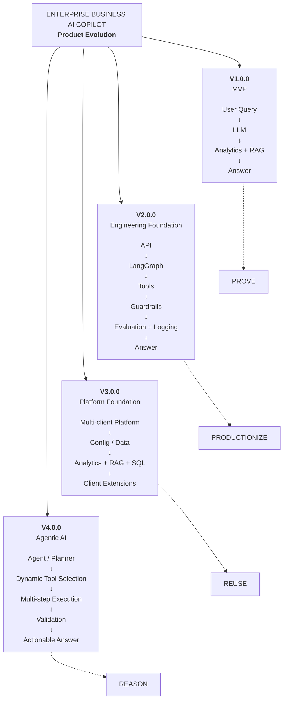
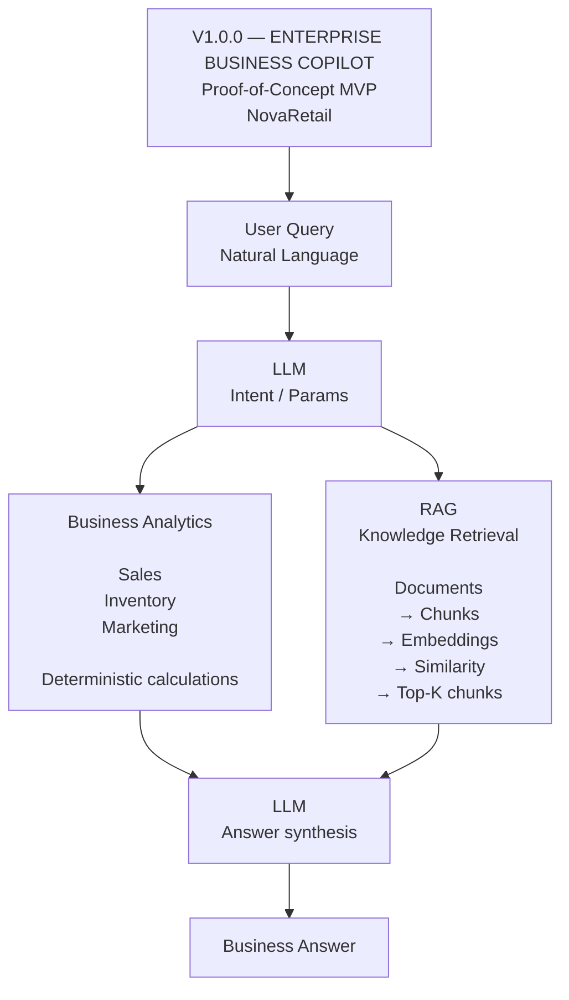
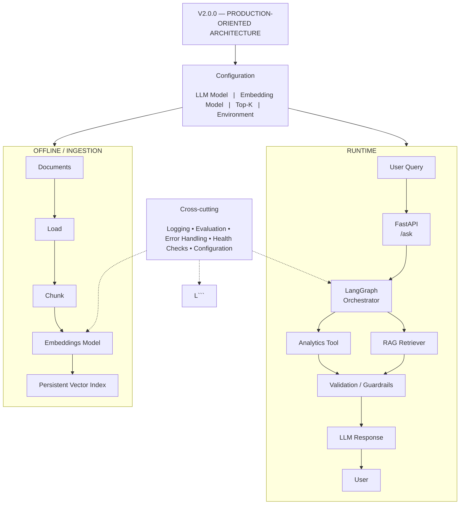
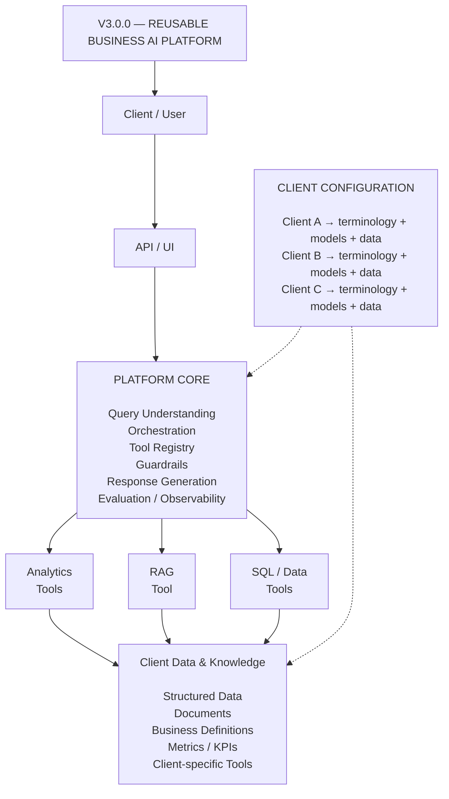

---


---




---





---


```mermaid
flowchart TB

    A["V4.0.0 — AGENTIC BUSINESS AI PLATFORM"]

    B["User<br/><br/>Why did sales fall and what should we do?"]

    C["Agent / Planner<br/><br/>Understand goal<br/>Plan steps<br/>Select tools"]

    A --> B
    B --> C

    C --> T1
    C --> T2
    C --> T3

    T1["Analytics<br/>Agent"]
    T2["RAG<br/>Agent"]
    T3["SQL / Data<br/>Agent"]

    T1 --> V
    T2 --> V
    T3 --> V

    V["Evaluate /<br/>Validate"]

    V --> D{"Need another<br/>step?"}

    D -->|Yes| C
    D -->|Complete| F["Final Business<br/>Recommendation"]
